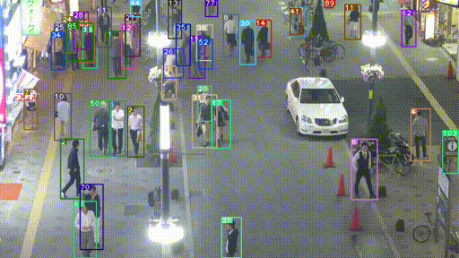

# Additional running tutorial

## Detection Module

### Generate VTX data for detection module

In `generate_data/combine_train_data.py`, replace `root_frames_dir` and `root_labels_dir` by folder with format:

```bash
root
| 
|___ VID_NAME_1
|       |___ frame_xxxxxx.jpg
|       |___ ...
|___ VID_NAME_2
        |___ frame_xxxxxx.jpg
        |___ ...
```

```bash
root
| 
|___ VID_NAME_1
|       |___ frame_xxxxxx.txt
|       |___ ...
|___ VID_NAME_2
        |___ frame_xxxxxx.txt
        |___ ...
```

Where `root_labels_dir` file is followed by `YOLO` labels format.

In **generate_data** folder, run:

```bash
sh create_data_tree.sh
```

Data format after generated:
```bash
root
| 
|___ images
|       |___ train
|       |       |___ frame_xxxxxx.jpg
|       |       |___ ...
|       |___ val
|               |___ frame_xxxxxx.jpg
|               |___ ...       
|        
|___ labels
        |___ train
        |       |___ frame_xxxxxx.txt
        |       |___ ...
        |___ val
                |___ frame_xxxxxx.txt
                |___ ...      
```


### Training Custom Data
**Follow** [Training Custom Data](https://github.com/ultralytics/yolov5/wiki/Train-Custom-Data)

**Note:**

0. Create data folder in the right format (YOLOV5 will check label paths corresponding to image paths.
1. In `data.yaml` file, set `nc = 1`, `name = [person]`. Replace `train` and `val` with absolute paths instead of relative paths as in the above tutorial.
2. `config yaml` file should be placed in `yolov5/data`.
3. Training with `crowdhuman_yolov5 checkpoint` need to set `Optimizer: ...` as `None` first, or else it'll be conflict during training.
4. File [hyp.scratch.yaml](https://github.com/ultralytics/yolov5/issues/607) in case it's not included in original repo (để trong folder yolov5/data/)
5. Training script

```bash
python train.py --data {data_yaml_file_config} --epochs {num_epochs} --batch {batches} --weights {weights path} --cfg {model config path}
```
If we use `crowdhuman_yolov5 checkpoint`, then we can use `yolov5m config file` in `yolov5/models/yolov5m.yaml`

Training result will be saved in `/yolov5/runs/train/exp{x}`. 

**Model best checkpoint after finetuned num class heads and training for 30 epoch on VTX DATA: [Checkpoint](https://wandb.ai/hainguyen/YOLOv5/artifacts/model/run_3gqwg2vr_model/ebe1245d78646d98df91/files)**

### Evaluate Detection Module (YOLOV5)
```bash
python test.py --data {data_yaml_file_config} --weights {weights_path} --save-txt --save-conf
```
Where `data config yaml` file set `train path` and `val path` as absolute path to images folder of test data (the model will test all images in the folder)

File label after evaluated will be save in `/yolov5/runs/test/exp{x}`

Evaluate result of `Finetune Model` on `VTX DATA` after training for 30 epochs and `Model pretrained on CrowdHman Dataset`: [Evaluation Results](https://docs.google.com/spreadsheets/d/1BOKNfHO-Ar7BzfpYRyFjux44B-I44XICpk7thhqd3MY/edit?fbclid=IwAR1GgUpXwZGpfFvW5TSdUTRWC09U4OIxLK2ajcDB218c0WngXt9ypyqVNhc#gid=0)


### Inferrence Detection Module (YOLOV5)
```bash
python detect.py --source {data_source_path} --weights {weights_path} --save-txt --save-conf
```
Where source can be path to 1 image or a whole image folder

Inference result is saved in `yolov5/runs/detect/exp{x}`

## ReID module
### Prepare data format for ReID module
The data format for ReID module is:
```bash
root
| 
|___ train
|       |___ id_1
|       |     |___ frame_xxxxxx.jpg
|       |     |___ ...
|       |
|       |___ id_2
|       |     |___ frame_xxxxxx.jpg
|       |     |___ ...       
|       |
|       |___ id_n
|             |___ frame_xxxxxx.jpg
|             |___ ...       
|        
|___ test
|       |___ id_1
|       |     |___ frame_xxxxxx.jpg
|       |     |___ ...
|       |
|       |___ id_2
|       |     |___ frame_xxxxxx.jpg
|       |     |___ ...       
|       |
|       |___ id_n
|             |___ frame_xxxxxx.jpg
|             |___ ...
|
|___ gallery
|       |___ id_1
|       |     |___ frame_xxxxxx.jpg
|       |     |___ ...
|       |
|       |___ id_2
|       |     |___ frame_xxxxxx.jpg
|       |     |___ ...       
|       |
|       |___ id_n
|             |___ frame_xxxxxx.jpg
|             |___ ...  
|
|___ query
        |___ id_1
        |     |___ frame_xxxxxx.jpg
        |     |___ ...
        |
        |___ id_2
        |     |___ frame_xxxxxx.jpg
        |     |___ ...       
        |
        |___ id_n
              |___ frame_xxxxxx.jpg
              |___ ...  
```

For `VTX Data`, the `train` folder contains 90% of the combine train data, the `test` folder contains the rest 10%. 

The `gallery` folder contains the whole test dataset. And the `query` folder is random splitted from `gallery`, 1 image for each id. 

### Training ReID module
The model have 2 checkpoints in the beginning. We can find those [here](https://drive.google.com/drive/folders/1xhG0kRH1EX5B9_Iz8gQJb7UNnn_riXi6).

To use `ckpt.t7` weight, in `deep_sort_pytorch/deep_sort/deep/model.py`, use the `Author's finetuned model` and set `num_classes = 751`

To use `original_ckpt.t7` weight, in `deep_sort_pytorch/deep_sort/deep/model.py`, use the `Original model` and set `num_classes = 625`

To use the trained weight on `VTX DATA`, in `deep_sort_pytorch/deep_sort/deep/model.py`, use the `Author's finetuned model` and set `num_classes = 868`

Training script:

```bash
python train.py --data-dir {path/to/data/root/dir} --ckpt {path/to/pretrained/reid/checkpoint} --save-ckpt-path {path/to/save/best/checkpoint} --save-result {path/to/save/training/curve/image}
```

You can find more arguments in `deep_sort_pytorch/deep_sort/deep/train.py`

### Testing ReID module
This step is used to create a features matrix for evaluating result.

In `deep_sort_pytorch/deep_sort/deep`, run:

```bash
python test.py --data-dir {path/to/data/root/dir} --ckpt {path/to/reid/checkpoint} --save-path {path/to/save/features/metric}
```

### Evaluating ReID module

In `deep_sort_pytorch/deep_sort/deep`, run:

```bash
python test.py --predict-path {path/to/saved/features/metric} --p_k {k in P@k evaluation} --map_n {n in mAP@n evaluation}
```

## Tracking

### Additional tracking source
**Tracking with video (default):**

```bash
python track_video.py --source {path/to/mp4/video} 
```

**Tracking with ensemble predicted result instead:**

```bash
python track.py --frame_dir {path/to/frame/dir} --det_pred_dir {path/to/ensemble/predict/dir} --gt_path {path/to/gt/file} --output {path/to/output/dir} --save-txt 
```
Where `det_pred_dir` is in `mmdetection` predict format, which is `<class_name> <confidence> <left> <top> <right> <bottom>` for each `txt` file. `gt file` is in `MOT` format.

The `output` is in `MOT` format, which is `<frame>, <id>, <bb_top>, <bb_left>, <bb_width>, <bb_height>, <conf>, <x>, <y>, <z>`.

### Tracking Evaluation
Following tutorial from [this repo](https://github.com/ConstantSun/MOT_Evaluation)

# Yolov5 + Deep Sort with PyTorch


<div align="center">
<p>
  
</p>
<br>
<div>
<a href="https://github.com/mikel-brostrom/Yolov5_DeepSort_Pytorch/actions"></a>
<br>  
<a href="https://colab.research.google.com/drive/18nIqkBr68TkK8dHdarxTco6svHUJGggY?usp=sharing"></a>
 
</div>

</div>


## Introduction

This repository contains a two-stage-tracker. The detections generated by [YOLOv5](https://github.com/ultralytics/yolov5), a family of object detection architectures and models pretrained on the COCO dataset, are passed to a [Deep Sort algorithm](https://github.com/ZQPei/deep_sort_pytorch) which tracks the objects. It can track any object that your Yolov5 model was trained to detect.


## Tutorials

* [Yolov5 training on Custom Data (link to external repository)](https://github.com/ultralytics/yolov5/wiki/Train-Custom-Data)&nbsp;
* [Deep Sort deep descriptor training (link to external repository)](https://github.com/ZQPei/deep_sort_pytorch#training-the-re-id-model)&nbsp;
* [Yolov5 deep_sort pytorch evaluation](https://github.com/mikel-brostrom/Yolov5_DeepSort_Pytorch/wiki/Evaluation)&nbsp;


## Before you run the tracker

1. Clone the repository recursively:

`git clone --recurse-submodules https://github.com/mikel-brostrom/Yolov5_DeepSort_Pytorch.git`

If you already cloned and forgot to use `--recurse-submodules` you can run `git submodule update --init`

2. Make sure that you fulfill all the requirements: Python 3.8 or later with all [requirements.txt](https://github.com/mikel-brostrom/Yolov5_DeepSort_Pytorch/blob/master/requirements.txt) dependencies installed, including torch>=1.7. To install, run:

`pip install -r requirements.txt`


## Tracking sources

Tracking can be run on most video formats

```bash
python3 track.py --source ... --show-vid  # show live inference results as well
```

- Video:  `--source file.mp4`
- Webcam:  `--source 0`
- RTSP stream:  `--source rtsp://170.93.143.139/rtplive/470011e600ef003a004ee33696235daa`
- HTTP stream:  `--source http://wmccpinetop.axiscam.net/mjpg/video.mjpg`


## Select a Yolov5 family model

There is a clear trade-off between model inference speed and accuracy. In order to make it possible to fulfill your inference speed/accuracy needs
you can select a Yolov5 family model for automatic download

```bash
python3 track.py --source 0 --yolo_weights yolov5s.pt --img 640  # smallest yolov5 family model
```

```bash
python3 track.py --source 0 --yolo_weights yolov5x6.pt --img 1280  # largest yolov5 family model
```


## Filter tracked classes

By default the tracker tracks all MS COCO classes.

If you only want to track persons I recommend you to get [these weights](https://drive.google.com/file/d/1gglIwqxaH2iTvy6lZlXuAcMpd_U0GCUb/view?usp=sharing) for increased performance

```bash
python3 track.py --source 0 --yolo_weights yolov5/weights/crowdhuman_yolov5m.pt --classes 0  # tracks persons, only
```

If you want to track a subset of the MS COCO classes, add their corresponding index after the classes flag

```bash
python3 track.py --source 0 --yolo_weights yolov5s.pt --classes 16 17  # tracks cats and dogs, only
```

[Here](https://tech.amikelive.com/node-718/what-object-categories-labels-are-in-coco-dataset/) is a list of all the possible objects that a Yolov5 model trained on MS COCO can detect. Notice that the indexing for the classes in this repo starts at zero.


## MOT compliant results

Can be saved to `inference/output` by 

```bash
python3 track.py --source ... --save-txt
```


## Cite

If you find this project useful in your research, please consider cite:

```latex
@misc{yolov5deepsort2020,
    title={Real-time multi-object tracker using YOLOv5 and deep sort},
    author={Mikel Broström},
    howpublished = {\url{https://github.com/mikel-brostrom/Yolov5_DeepSort_Pytorch}},
    year={2020}
}
```


## Other information

For more detailed information about the algorithms and their corresponding lisences used in this project access their official github implementations.


# draw pred and gt boxes:
 File track.py:
- Comment line 298
- Remove opt.mode in line 216, 234
